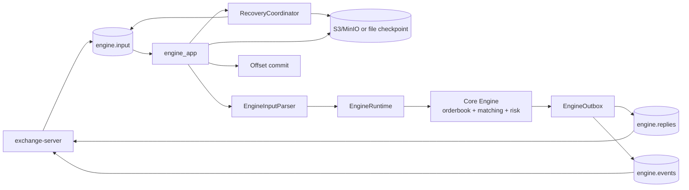
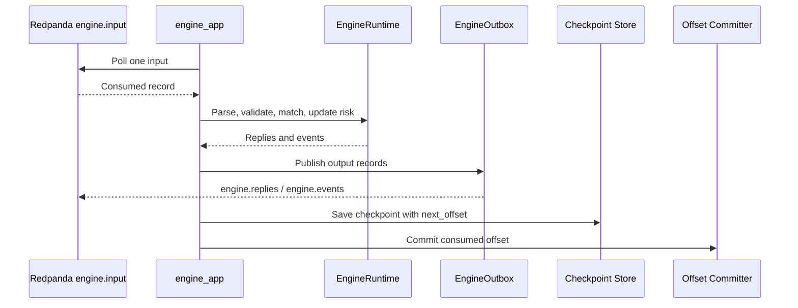
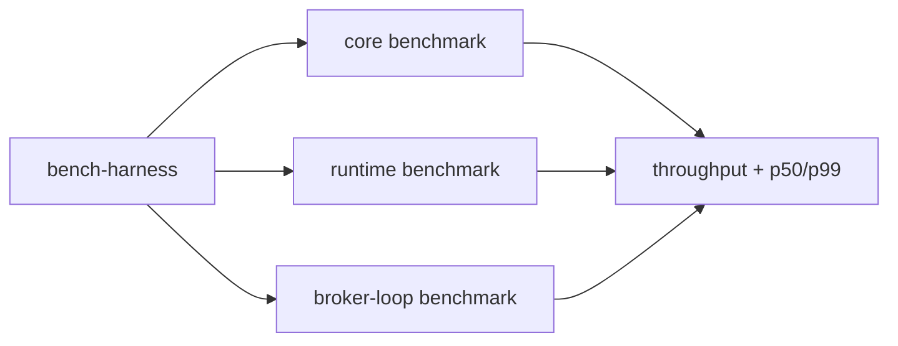

# Perpex Engine

C++20 matching and risk engine for Perpex. It consumes ordered exchange inputs
from Redpanda, applies deterministic matching and risk logic, publishes replies
and durable events, and checkpoints state for recovery.

The exchange server is a separate process. Exchange owns API, wallet checks,
accounting, read models, and websocket fanout. Engine owns `engine.input`,
matching/risk state, checkpoints, and `engine.replies` / `engine.events`.

## Architecture



## Flow



Checkpoints are saved before input offsets are committed. If checkpoint save
fails, the engine fails loudly and does not commit the offset.

## Core Features

- Price-time priority matching with deterministic orderbook behavior.
- Runtime validation for place, cancel, liquidation, mark price, and funding
  inputs.
- JSON stream contract shared with the exchange repo.
- Redpanda app boundary for `engine.input`, `engine.replies`, and
  `engine.events`.
- File and S3-compatible checkpoint stores for recovery.
- Focused benchmark harness for core, runtime, and broker-loop measurements.

## Project Structure

```text
include/core        Public core orderbook, matching, fixed point, and risk types
src/core            Core engine implementation
include/runtime     Runtime parser, output, and orchestration interfaces
src/runtime         Runtime implementation
include/broker      Broker interfaces and Redpanda app boundary
src/broker          Redpanda processing wrapper
include/checkpoint  Checkpoint interfaces and data model
src/checkpoint      File and S3 checkpoint stores
include/recovery    Checkpoint recovery interfaces
src/recovery        Recovery implementation
src/app             engine_app config and executable entrypoint
bench               Benchmark binaries and workload generators
bench-harness       Benchmark scripts
test-harness        Manual smoke and exchange e2e scripts
docs                Protocol, local development, and configuration docs
tests               Unit, fixture, recovery, broker, and smoke tests
```

## Quick Start

Use sibling checkouts:

```sh
mkdir -p ~/perpex
cd ~/perpex
git clone git@github.com:whoisasx/exchange-engine.git engine
git clone git@github.com:whoisasx/exchange-server.git exchange
```

Start exchange-owned infra:

```sh
cd ~/perpex/exchange
test-harness/infra.sh up
```

Run the engine:

```sh
cd ~/perpex/engine
test-harness/run-exchange-e2e-engine.sh
```

In another terminal, run the exchange smoke:

```sh
cd ~/perpex/exchange
test-harness/smoke.sh
```

Expected result:

```text
e2e smoke passed
e2e smoke complete
```

## Benchmarks

The engine benchmark harness separates matching cost from runtime parsing and
broker-loop overhead.



Run the full local matrix:

```sh
bench-harness/run-all.sh
```

See [bench-harness/README.md](bench-harness/README.md) for scenarios, output
schema, and tunable environment variables.

## Tech Stack

- Language: C++20
- Build: CMake
- Streams: Redpanda / Kafka protocol through `librdkafka++`
- Checkpoints: file store or S3-compatible object storage
- HTTP/object calls: libcurl
- Tests: CTest plus JSON fixture tests

## Documentation

- [Local development](docs/local-development.md)
- [Configuration](docs/configuration.md)
- [Test harness](test-harness/README.md)
- [Benchmark harness](bench-harness/README.md)
- [Engine stream contract](docs/engine-contract.md)
- [Protocol fixtures](docs/examples/README.md)
