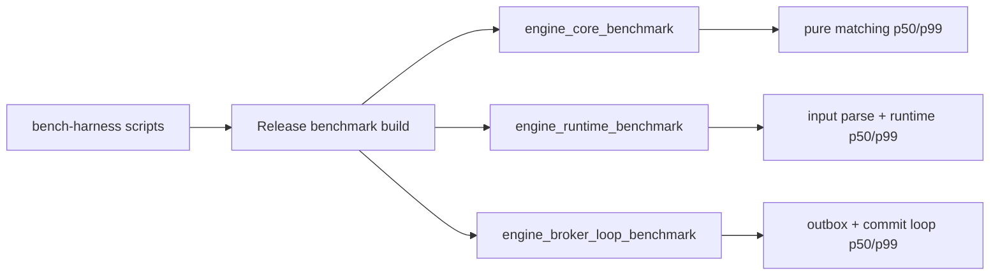
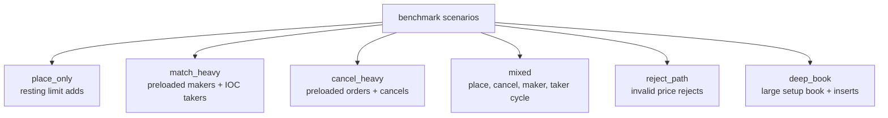

# Engine Benchmark Harness

This folder measures engine latency and throughput without changing the manual
exchange e2e harness. Benchmarks are opt-in CMake targets built in Release mode.



## Quick Run

Run one scenario against the core matcher:

```sh
bench-harness/run-core.sh --scenario mixed --commands 100000 --warmup 5000
```

Run runtime parsing and engine processing:

```sh
bench-harness/run-runtime.sh --scenario mixed --commands 100000 --warmup 5000
```

Include JSON output serialization:

```sh
bench-harness/run-runtime.sh \
  --scenario mixed \
  --commands 100000 \
  --warmup 5000 \
  --include-output-serialization
```

Run the in-process broker loop, including JSON outbox serialization and offset
commit logic:

```sh
bench-harness/run-broker-loop.sh --scenario mixed --commands 100000 --warmup 5000
```

Run the full local benchmark matrix:

```sh
bench-harness/run-all.sh
```

Results are written to `bench-results/<UTC timestamp>/`.

The full matrix writes these reports for each scenario:

- `core-<scenario>.json`
- `runtime-<scenario>.json`
- `runtime-serialized-<scenario>.json`
- `broker-loop-<scenario>.json`

Use these layers to compare `throughput_per_sec`, `latency_ns`,
`output_records`, and `output_bytes`.

## Scenarios



Supported scenarios:

- `place_only`: resting limit order adds.
- `match_heavy`: preloads makers, then measures crossing takers.
- `cancel_heavy`: preloads resting orders, then measures cancels.
- `mixed`: repeats place, cancel, maker add, taker match.
- `reject_path`: invalid price rejects.
- `deep_book`: builds a deep book before measuring more inserts.

## Output

Each benchmark prints JSON:

```json
{
  "component": "runtime",
  "scenario": "mixed",
  "commands": 100000,
  "include_output_serialization": true,
  "throughput_per_sec": 50000.0,
  "output_records": 100000,
  "output_bytes": 6400000,
  "latency_ns": {
    "p50": 1000,
    "p90": 2000,
    "p95": 3000,
    "p99": 5000,
    "p999": 10000,
    "max": 50000
  }
}
```

The useful comparison order is:

1. `core`: pure matching cost.
2. `runtime`: JSON parsing, validation, risk, replies, and events.
3. `runtime --include-output-serialization`: runtime plus output JSON
   serialization.
4. `broker_loop`: runtime, outbox JSON serialization, producer boundary,
   optional checkpoint delay, and offset commit boundary.

## Useful Environment Variables

- `ENGINE_BENCH_COMMANDS`: command count for `run-all.sh`.
- `ENGINE_BENCH_WARMUP`: warmup command count for `run-all.sh`.
- `ENGINE_BENCH_BOOK_DEPTH`: setup depth for `deep_book`.
- `ENGINE_BENCH_CHECKPOINT_DELAY_US`: synthetic checkpoint delay for
  `broker_loop`.
- `ENGINE_BENCH_RESULT_DIR`: result root directory.
- `ENGINE_BENCH_BUILD_DIR`: benchmark build directory.
- `ENGINE_BENCH_BUILD_TYPE`: CMake build type, defaults to `Release`.
