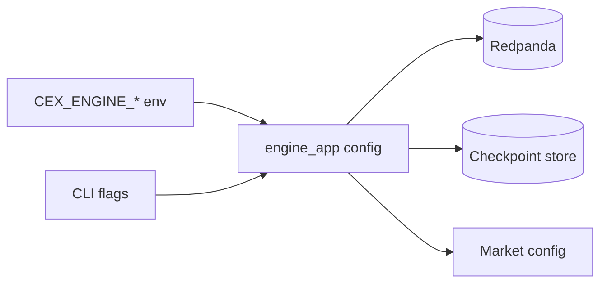

# Engine Configuration

`engine_app` accepts CLI flags and matching `CEX_ENGINE_*` environment
variables. Prefer the test harness script for local e2e runs:

```sh
test-harness/run-exchange-e2e-engine.sh
```

That script builds `engine_app` and points it at the exchange harness Redpanda
and MinIO services with `test-harness/exchange-e2e-markets.conf`.

## Common Settings

| Environment variable | Purpose |
|---|---|
| `CEX_ENGINE_BOOTSTRAP_SERVERS` | Redpanda/Kafka bootstrap servers |
| `CEX_ENGINE_GROUP_ID` | Consumer group id |
| `CEX_ENGINE_CHECKPOINT_STORE` | `s3` or `file` |
| `CEX_ENGINE_CHECKPOINT_S3_ENDPOINT` | S3/MinIO endpoint |
| `CEX_ENGINE_CHECKPOINT_S3_BUCKET` | Checkpoint bucket |
| `CEX_ENGINE_MARKETS_CONFIG` | Market config file |

## Runtime Wiring



The exchange e2e harness expects:

- Redpanda at `127.0.0.1:19092`.
- MinIO at `http://127.0.0.1:59000`.
- Checkpoint bucket `exchange-checkpoints`.
- Input topic `engine.input`.
- Reply topic `engine.replies`.
- Event topic `engine.events`.
