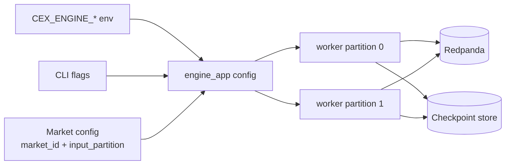

# Engine Configuration

`engine_app` accepts CLI flags and matching `CEX_ENGINE_*` environment
variables. Prefer the test harness script for local e2e runs:

```sh
test-harness/run-exchange-e2e-engine.sh
```

That script builds `engine_app` and points it at the exchange harness Redpanda
and MinIO services with `test-harness/exchange-e2e-markets.conf`.

## Common Settings

| Environment variable | Purpose |
|---|---|
| `CEX_ENGINE_BOOTSTRAP_SERVERS` | Redpanda/Kafka bootstrap servers |
| `CEX_ENGINE_GROUP_ID` | Consumer group id |
| `CEX_ENGINE_CHECKPOINT_STORE` | `s3` or `file` |
| `CEX_ENGINE_CHECKPOINT_S3_ENDPOINT` | S3/MinIO endpoint |
| `CEX_ENGINE_CHECKPOINT_S3_BUCKET` | Checkpoint bucket |
| `CEX_ENGINE_MARKETS_CONFIG` | Market config file |

## Runtime Wiring



The exchange e2e harness expects:

- Redpanda at `127.0.0.1:19092`.
- MinIO at `http://127.0.0.1:59000`.
- Checkpoint bucket `exchange-checkpoints`.
- Input topic `engine.input`.
- Reply topic `engine.replies`.
- Event topic `engine.events`.

## Market Config

The built-in default market is `SOL-PERP` on `input_partition = 0`. A market
config file must provide one `input_partition` per market:

```text
[[market]]
market_id = 1
market_name = SOL-PERP
input_partition = 0
tick_size = 1
lot_size = 1
min_quantity = 1
max_quantity = 1000000
min_price = 1
max_price = 1000000
ring_capacity_ticks = 1000
threshold_percentage = 10
initial_base_tick = 0
price_scale = 0
quantity_scale = 0
maker_fee_rate = 0
taker_fee_rate = 0
trading_enabled = true
```

Duplicate `input_partition` values are rejected. The exchange publisher must
key `engine.input` records by `market_id` so Redpanda routes every market to
the partition owned by its engine worker.

For the local exchange e2e harness, `engine.input` defaults to eight
partitions. The included `test-harness/exchange-e2e-markets.conf` therefore
uses `input_partition = 4` for `market_id = 1` and `input_partition = 5` for
`market_id = 2`, matching the exchange publisher's stable partition function.
