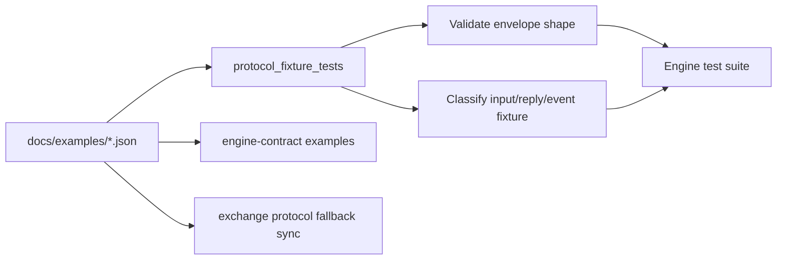

# Engine Examples

This directory contains JSON fixtures for the engine stream contract.

All JSON fixtures in this directory are parsed by the C++
`protocol_fixture_tests` target for top-level protocol shape and fixture
classification.

The fixtures include mark price, funding, account delta, liquidation lifecycle,
ADL, orderbook snapshot, and checkpoint messages. Metadata fields such as
`engine_event_id`, `source_input_id`, and `source_input_offset` are first-class
stream contract fields; optional fields should stay in fixtures when producers
are expected to set them.

