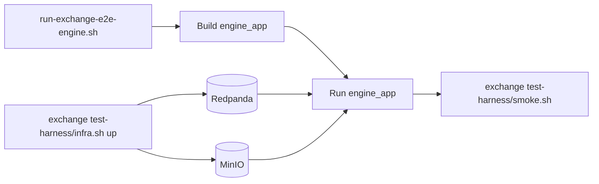

# Engine Test Harness

This folder is the only manual test surface for the engine repo. The engine
harness owns engine build/run/smoke commands; exchange owns shared local infra.



## Get the Repos

Use sibling checkouts so the exchange and engine harness scripts can be run from
their default paths:

```sh
mkdir -p ~/perpex
cd ~/perpex
git clone git@github.com:whoisasx/exchange-engine.git engine
git clone git@github.com:whoisasx/exchange-server.git exchange
```

HTTPS works too:

```sh
git clone https://github.com/whoisasx/exchange-engine.git engine
git clone https://github.com/whoisasx/exchange-server.git exchange
```

## Full Exchange E2E Engine Run

First start exchange infra from the exchange repo:

```sh
cd ../exchange
test-harness/infra.sh up
```

Then start `engine_app` from this repo:

```sh
cd ../engine
test-harness/run-exchange-e2e-engine.sh
```

This script builds `engine_app` and runs it against the exchange harness
Redpanda and MinIO endpoints with `test-harness/exchange-e2e-markets.conf`.
That config maps one market to one `engine.input` partition:

```text
SOL-PERP market_id=1 input_partition=4
ETH-PERP market_id=2 input_partition=5
```

The exchange harness creates `engine.input` with multiple partitions and
publishes engine inputs with `market_id` as the record key. The default local
topic has eight partitions, so the sample config uses the exchange publisher's
stable partition results for keys `"1"` and `"2"`.

In another terminal, run the exchange smoke:

```sh
cd ../exchange
test-harness/smoke.sh
```

Stop `engine_app` with `Ctrl-C`, then stop exchange infra:

```sh
cd ../exchange
test-harness/infra.sh down
```

## Engine-Only Smoke

Run offline engine smoke tests:

```sh
test-harness/smoke.sh --skip-redpanda
```

Run the Redpanda-backed engine smoke only after an `engine_app` process is
already running against a reachable Redpanda cluster:

```sh
test-harness/smoke.sh --require-redpanda
```

## Scripts

- `run-exchange-e2e-engine.sh`: builds and runs `engine_app` for the exchange
  e2e harness.
- `smoke.sh`: builds engine targets, runs the offline smoke, and optionally
  verifies that an already-running engine publishes Redpanda replies/events.
